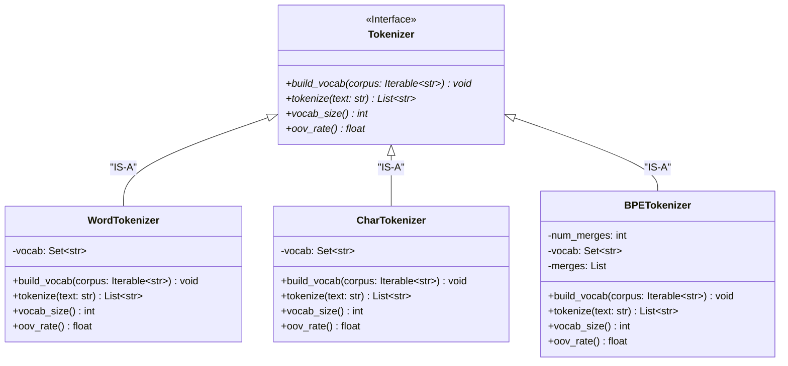

```mermaid

classDiagram
    direction TB

    class Tokenizer {
        <<Interface>>
        +build_vocab(corpus: Iterable~str~) void*
        +tokenize(text: str) List~str~*
        +vocab_size() int*
        +oov_rate() float*
    }
    

    class WordTokenizer {
        -vocab: Set~str~
        +build_vocab(corpus: Iterable~str~) void
        +tokenize(text: str) List~str~
        +vocab_size() int
        +oov_rate() float
    }

    class CharTokenizer {
        -vocab: Set~str~
        +build_vocab(corpus: Iterable~str~) void
        +tokenize(text: str) List~str~
        +vocab_size() int
        +oov_rate() float
    }

    class BPETokenizer {
        -num_merges: int
        -vocab: Set~str~
        -merges: List
        +build_vocab(corpus: Iterable~str~) void
        +tokenize(text: str) List~str~
        +vocab_size() int
        +oov_rate() float
    }
    

    Tokenizer <|-- WordTokenizer : "IS-A"
    Tokenizer <|-- CharTokenizer : "IS-A"
    Tokenizer <|-- BPETokenizer : "IS-A"

```